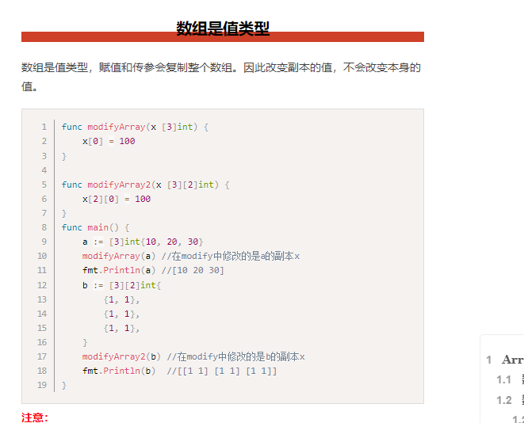
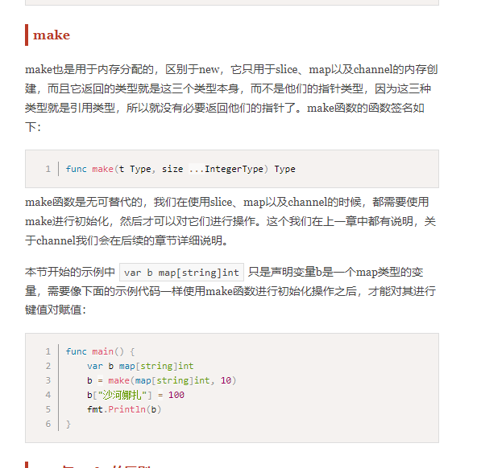
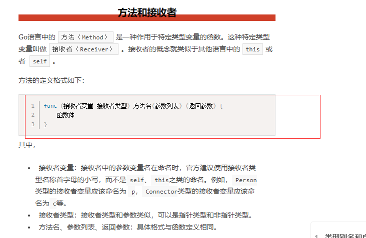
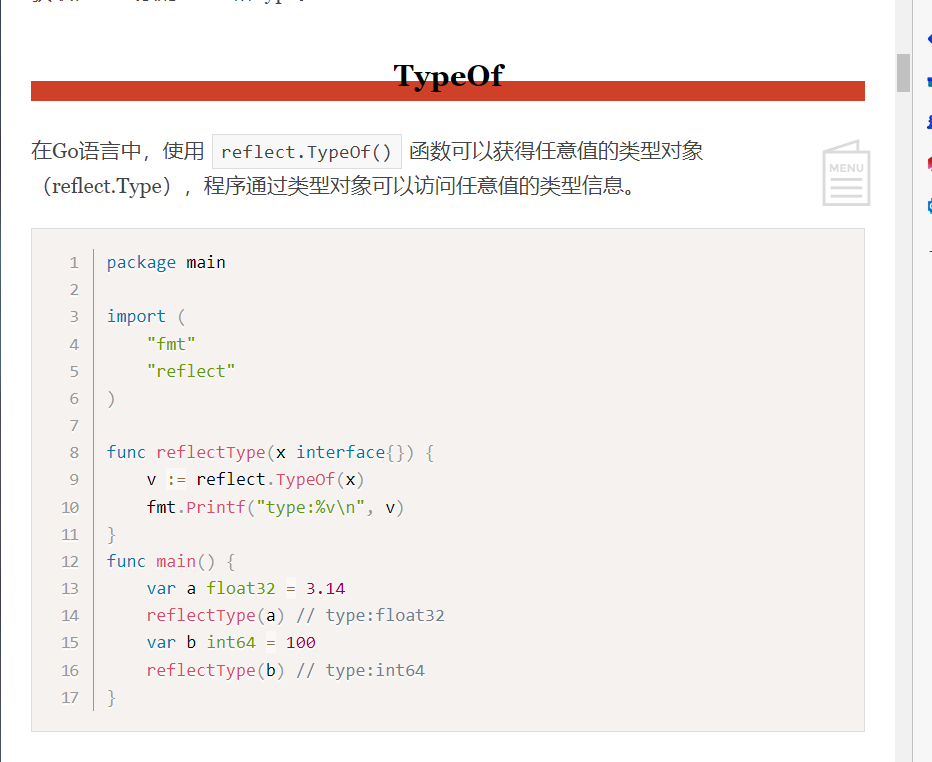

# 基础

## 1..创建一个hello

1.使用vscode创建一个hello文件  在hello文件下创建一个go.mod文件

main 是用来写主函数  编译运行后产生hello.exe 运行程序

2.导入包输入import  

3.终端输入命令

使用go build  加上项目名运行

其他命令

总结：go.mob里写导入依赖  main.go 主函数 导入其他包使用import  exe是生成程序

## 2.导入快捷命令

类似配置输入输出

## 3.依赖管理

要导入别人的依赖  项目中必须有一个 go mod   导入依赖  没有的话自己创建

使用别人依赖

## 4.变量和常量

go中声明  var + 名字 +类型  一般

中括号批量声明

变量声明后必须使用

2.可不声明 根据类型

函数内存可使用短声明  n:=10

3.常量 const

4.iota记录常量中的索引

## 5.数据类型

整形 两大类 有符号和无符号类型

不同表示进制

下面的案例是输入不同机制  使用10进制显示

浮点数

字符串常用函数 调用strings类的函数

替换前后缀

如果字符串是多行  使用反引号

byte和runne

使用中午或者日文时使用

打印例子

使用rune可以正常显示中文

重点：修改字符串需要将其先进性转化。再转回string

## 6.结构

if语句

for

switch

goto跳出所有循环

## 7.数组

1.定义数组

注意数组的长度也属于数组的一部分，长度不相等，两个数组不想恒

2.初始化

直接var 变量名=数组类型

3.数组的遍历

4.二维数组

5.多维数组只有一层使用...来让显示器推到长度

6.数组是值类型与c++不一致

## 8.切片

切片

在java里面，当我们向截取数组中某一部分时，需要申请新数组，进行拷贝。

go数组缺点

切片

类似字符串截取

low high 是一个左闭又开区间

长度 容量

完整的切片表达式

make做切片，动态分配

本子

判断切片是否为空

切片拷贝，是地址

类似java插入一段字符串

扩容 两倍

使用copy函数复制

切片中删除函数  使用覆盖的思想

## 8.map

定义

基本使用

判断某个键是否存在

map遍历

delete删除键值对

两种特殊类型

## 9.函数

重点搞懂闭包概念

[(15条消息) Golang中闭包的理解_Erick_Lv的博客-CSDN博客_golang的闭包](https://blog.csdn.net/qq_35976351/article/details/81986496)

函数

例子

函数参数注意，先写名字 在写类型  两个以上只写后面

函数可返回多个值

全局变量和局部变量

函数类型可以提前定义，将同类型的函数可以复制给当前定义的函数

函数还可作为参数和返回值

重点闭包

1.匿名函数

好处  动态的写出来，需要什么写什么

2.闭包

好处：匿名函数不需要人为输入，可以直接使用外面的变量

defer语句

处于defer语句的比非defer会延迟进行，defer代码块中的语句倒序执行。

常见内置函数

异常处理（之后细细研究）

## 10.指针

go里面对指针的与c类似，不过其只有取值和取地址，没有偏移操作。

问题抛出

应用类型的变量声明 还必须为他分配内存空间

使用new 和mak

new 和make的区别

返回不同 new返回指针  make返回引用类型本身

什么时候用指针

对于基本类型 数组 值 改值时必须用指针 下面使用*来取值

而对于结构体 一般也用指针 只不过不需要* 来取值

## 11.结构体

自定义类型和类型别名

区别

结构体定义与c类似  不过这里同样没有什么构造函数，需要的话自己写

实例化

创建指针类型结构体。这里提一嘴，若需要传入方法里面改变其值，我们还是需要穿结构体指针

使用new运算符得到的是指针

初始化

使用键值对初始化

值列表初始化

结构体内存布局实际上类似数组 是一片连续的空间

如果实现构造函数  返回值最好是指针

因为返回是普通的结构体，必然会有一个值拷贝过程，效率慢。

接受者实际就是方便来传入结构体，然后进行操作

方法函数的特定区别

什么时候需要指针？

结构体中的继承  实际就是儿子有父亲的指针 

重点  方法的接受者

如何在go中struct加入方法

通过方法接受者模式  类似于挂载 将方法挂到对象上

也就是接受者是要被加入方法的类对象，

指针类型接受者

## 12.包

学习网站

学习地址

[Go语言基础之包 | 李文周的博客 (liwenzhou.com)](https://www.liwenzhou.com/posts/Go/11-package/)

## 13.接口

定义

实现接口

这里就实现啦一个多态的实现

步骤：

1.声明接口  接口中的函数

2.声明一个结构体

3.将结构构体上挂载添加与接口同名函数

4.写一个函数  参数类型是接口  方法里调用其方法  也就是接口类型指向其子类类型这种形式

空接口的用处  传参可以任意传

类型断言

这里类似泛型的概念

## 14.error接口

没有类似java中的trycatch来处理

这里相当于直接抛异常

自定义错误接口

输出错误

错误结构体

项目中如何处理error

默认值为nil  用两个参数接受  然后第一个是最长返回的值，第二个是异常接受，然后使用if处理是否有异常

## 15.反射

学习网址

[Go语言基础之反射 | 李文周的博客 (liwenzhou.com)](https://www.liwenzhou.com/posts/Go/13_reflect/)

与java里面类似 都是获取类对象进行操作

函数中传入参数为接口 这样子方便接受任何类型

使用reflect包下的工具

name 和kind

type是机制类型，kind多用于自定义类型

如果要修改值  必须进行转换  reflect下的类型转为原生类型

案例

通过反射改值必须使用elem

结构体反射

## 16.并发

学习笔记

[Go语言基础之并发 | 李文周的博客 (liwenzhou.com)](https://www.liwenzhou.com/posts/Go/concurrence/#autoid-0-6-3)

、

这里面管道 可边读边写

同样适用互斥和同步

需要注意

为了让main线程不那么3快执行完  我们需要等一下

启动多个go

channel类型

例子

异常情况提示

注意无缓存通道  必须要有接受者  

forrange接收值快一点

单向通道

select多路复用

案例

接下来是并发和锁  按网站学习

## 17.细节补充下划线

下划线的用处  忽略某些返回值

首先 read函数会有两个返回值  第二个一般是error

此时由于我们不想处理这个返回值

导包时的作用

细致讲解导包

[(15条消息) golang中的下划线(_)用法_raoxiaoya的博客-CSDN博客_golang 下划线](https://blog.csdn.net/raoxiaoya/article/details/108872221)

我们只要这个包的init函数，不需要导入包中其他

## 18.网络编程socket

客户端  服务端

此处学习

[Go语言基础之网络编程 | 李文周的博客 (liwenzhou.com)](https://www.liwenzhou.com/posts/Go/15_socket/#autoid-2-2-2)

#### 1.遇到问题总结3

EOF用处

## 19.定时器

单独用处  类似sleep暂停时间  有点  可以提前取消

## 20.打点器

隔一段时间做一件事

这里解析

打点器实际上就是一个通道  我们可以每隔一段时间在里面拿到值  通过select去拿 就达到啦每隔多少秒去做一个任务

解析

## 21.工作池

重点实现

## 22.workGroup实例

案例

成功案例

失败案例

原因分析

for里面的i是一个值，到最后都会是4

一定要理解for是main线程管的  go线程并发启动的

就是意思就是 我用B这种方法 然后因为我用的是for循环里面的那个i 但是有可能 i走到尾巴哦 go线程才启动 所以是4

就是原来 main线程控制i变化  go线程输入i 但是可能main线程i变化太快哦 然后go拿的时候 i以及变为4

## 23.速率限制重点

之后眼界

## 24.原子计数器

类似java的autointeger类似  i++操作是原子性的

## 25.互斥锁

## 26.通过线程通信解决互斥问题

之后细细研究 也就是通过管道 恢复的消息类型 判断此状态是否已经被其他线程占有

## 27.排序

使用格式：

sort.

自定义排序

## 28.panic

error初始是nil值  不等于nil代表遇到错误  这里使用panic类似抛出异常 而且停止程序

## 29.recover

需求   抛出pannic时  我们并不希望程序完全崩溃

## 30.字符串格式化

主要处理输出

## 31.json

json转基本数据类型

首先使用一个map【string】接口

string是为啦获取json中的key  接口是为啦获取任意值的value

基本转json

## 32.xml

## 33.时间

## 31.时间戳

## 35.时间格式化

## 36.随机数

## 37.解析url地址

## 38.文件

读文件

写文件

## 39.行过滤器

也就对输入进行处理转变为输出

## 40.文件路径

## 41.回调函数

1.首先函数也可以作为一种数据类型

声明这个类型变量后  我们就可以调用类型满足的函数

缺点 这里实际上还是调用对应函数，问题抛出 那我直接add  minus(a,b)不就行啦？不是一样效果嘛

当某个函数函数的形参列表至少有一个函数类型时。既可以通过我们传入不同的函数，实现类似java中多态的功能

这里我们caculate里面有caculate类型形参 然后传入add 或者divide 就能调用不同的功能

# Gin框架

1.helloworld

注意需要开启这个设置

r.get 方式 就是获取url  看是否能出发函数

路由有好几种方法

2.获取url参数

使用param

3.获取Query参数

url参数格式

4.获取POST参数

注意改为POST请求

浏览器上显示为JSON格式

5.post和Query混合

总结：/user/name  使用param获取参数

?user=Ton&name=wwy 使用query

post请求用ppost获取即可

显示信息  一些需要转换为json对象

6.Map参数

7.重定向

8.分组路由

也就是后面获取请求不需要每个都加上前缀

9.上传文件

10.html模板

11.中间件

